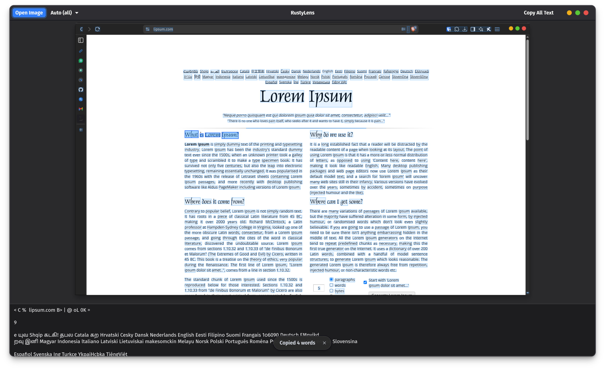

# GUI Mode



## Opening an image

```bash
rustylens
```

1. Click **Open Image** in the header bar (or use the keyboard shortcut).
2. The native file chooser opens — select any image (PNG, JPEG, TIFF, BMP, WebP, etc.).
3. OCR runs automatically on a background thread. Extracted text appears in the panel below the image preview.

---

## Reading the results

The image preview shows coloured bounding boxes around every recognised word. The text panel on the right shows the full extracted text.

---

## Selecting and copying words

You can select individual words or a range directly on the image:

- **Click** a highlighted word to select it.
- **Click and drag** across multiple words to select a range.
- Press ++ctrl+c++ to copy the selected words to your clipboard (in reading order).
- Click **Copy All Text** to copy the entire extracted text at once.

Selected words are highlighted with a stronger colour overlay.

---

## Changing the OCR language

Use the **language dropdown** in the header bar to switch languages. The dropdown auto-populates from all Tesseract language packs installed on your system.

- Language names are shown in full — "French" not `fra`, "Japanese" not `jpn`, "Chinese (Simplified)" not `chi_sim`. All ~100 standard Tesseract codes are mapped to their display names.
- **Auto (all)** uses every installed language pack simultaneously — useful when the language of the image is unknown, but slower and less accurate than selecting a specific language.
- For best accuracy and speed, select the specific language that matches your image.

!!! tip
    The language dropdown is populated at startup. If you install a new language pack while RustyLens is running, restart the app to see it.

---

## Re-running OCR

Changing the language in the dropdown automatically re-runs OCR on the current image. No need to reload the file.
